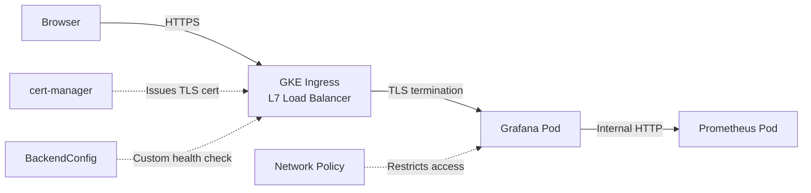

# ML Training Operator — Operations Guide

---

# Part 1: Getting Started

## 🎉 Your Operator is Running!

```
controller-manager   1/1     Running   0   3m55s
INFO    Starting workers   {"controller": "trainingjob", "worker count": 1}
```

---

## Step 1: Install the CRD (Custom Resource Definition)

The CRD teaches Kubernetes what a `TrainingJob` resource is:

```bash
kubectl apply -f kubernetes/base/trainingjob-crd.yaml

# Verify it's installed:
kubectl get crd trainingjobs.ml.example.com
```

---

## Step 2: Submit a TrainingJob

The example files target namespace `ml-training`. Create it first, then submit a job:

```bash
# Create the namespace
kubectl create namespace ml-training

# Submit a simple training job
kubectl apply -f examples/trainingjob-simple.yaml

# Check it:
kubectl get trainingjobs -n ml-training
# Output: NAME            STATE     PROGRESS   EPOCH   AGE
#         resnet-simple   Pending                       5s
```

Watch the status change from `Pending` → `Initializing` → `Running`:
```bash
kubectl get trainingjobs -n ml-training -w
```

View details:
```bash
kubectl describe trainingjob resnet-simple -n ml-training
```

---

## Step 3: Check Operator Metrics (Quick Test)

Your operator exposes Prometheus metrics on port `8080`. Test it directly:

```bash
# Port-forward the metrics endpoint to your Cloud Shell
kubectl port-forward deployment/controller-manager 8080:8080 -n default &

# Fetch raw metrics
curl http://localhost:8080/metrics 2>/dev/null | grep trainingjob
```

You should see custom metrics like:
- `trainingjob_created_total` — jobs created per namespace
- `trainingjob_active_workers` — current active workers
- `trainingjob_allocated_gpus` — GPUs allocated per job
- `trainingjob_failed_total` — failed jobs by reason

---

## Step 4: Set Up Prometheus + Grafana

### Install Helm + Prometheus Stack

```bash
# Install Helm (if not installed)
curl https://raw.githubusercontent.com/helm/helm/main/scripts/get-helm-3 | bash

# Add the Prometheus community repo
helm repo add prometheus-community https://prometheus-community.github.io/helm-charts
helm repo update

# Install kube-prometheus-stack (includes Prometheus + Grafana)
# - LoadBalancer: exposes Grafana via external IP (avoids Cloud Shell CSRF issues)
# - serviceMonitorSelectorNilUsesHelmValues=false: discovers ALL ServiceMonitors
# - sidecar: enables auto-import of dashboards from ConfigMaps
# - coreDns/kubeEtcd disabled: prevents false alerts on GKE
helm install monitoring prometheus-community/kube-prometheus-stack \
  --namespace monitoring --create-namespace \
  --set prometheus.prometheusSpec.serviceMonitorSelectorNilUsesHelmValues=false \
  --set grafana.sidecar.dashboards.enabled=true \
  --set grafana.sidecar.dashboards.label=grafana_dashboard \
  --set grafana.service.type=LoadBalancer \
  --set coreDns.enabled=false \
  --set kubeEtcd.enabled=false
```

### Apply Metrics Service + ServiceMonitor

```bash
# Apply the metrics service for the operator
kubectl apply -f kubernetes/base/service.yaml

# Fix the service port to match the operator's metrics port (8080)
kubectl patch svc controller-manager-metrics-service -n default --type=merge \
  -p '{"spec":{"ports":[{"name":"metrics","port":8080,"targetPort":8080,"protocol":"TCP"}]}}'

# Create the ServiceMonitor in the monitoring namespace
# - Must be in 'monitoring' namespace for reliable Prometheus discovery
# - Label 'release: monitoring' matches the Helm release name
# - namespaceSelector tells Prometheus to scrape from 'default' namespace
cat <<'EOF' | kubectl apply -f -
apiVersion: monitoring.coreos.com/v1
kind: ServiceMonitor
metadata:
  name: trainingjob-operator-metrics
  namespace: monitoring
  labels:
    release: monitoring
spec:
  selector:
    matchLabels:
      control-plane: controller-manager
  endpoints:
    - port: metrics
      path: /metrics
      interval: 15s
      scheme: http
  namespaceSelector:
    matchNames:
      - default
EOF
```

### Auto-Import the Dashboard (No Manual Upload Needed)

```bash
# The ConfigMap has label 'grafana_dashboard: "1"' which tells
# Grafana's sidecar to auto-discover and load the dashboard
kubectl apply -f kubernetes/monitoring/grafana-dashboard-configmap.yaml
```

### Access Grafana

```bash
# Get the external IP (wait ~30 seconds for it to appear)
kubectl get svc monitoring-grafana -n monitoring -w

# Get the admin password from the Kubernetes secret
kubectl get secret --namespace monitoring monitoring-grafana \
  -o jsonpath="{.data.admin-password}" | base64 -d ; echo
```

Open `http://<EXTERNAL-IP>` in your browser directly. Login with `admin` + the password above.

Your **TrainingJob Operator Metrics** dashboard is pre-loaded under **Dashboards** in the left sidebar.

---

## Useful Commands Reference

| Action | Command |
|--------|---------|
| Check operator status | `kubectl get pods -n default` |
| View operator logs | `kubectl logs -l control-plane=controller-manager -n default` |
| List all training jobs | `kubectl get trainingjobs --all-namespaces` |
| Describe a job | `kubectl describe trainingjob <name> -n <ns>` |
| Delete a job | `kubectl delete trainingjob <name> -n <ns>` |
| View raw metrics | `kubectl port-forward deploy/controller-manager 8080:8080 & curl localhost:8080/metrics` |

---

## What Happened: Root Cause Summary

The 2-day debugging journey came down to one issue: **`cmd/main.go` on Cloud Shell was corrupted** — it contained controller code (`package controller`) instead of the entry point (`package main`). This caused `go build` to produce a Go archive file instead of an executable binary, which surfaced as `exec format error` or was masked by `permission denied` depending on which version ran first.

---


# Part 2: Production Hardening

This section adds enterprise-grade security layers on top of the basic setup from Part 1.

## Architecture



| Layer | What We'll Use | Production Equivalent |
|-------|---------------|----------------------|
| **DNS** | nip.io (free wildcard) | Cloud DNS + real domain |
| **TLS** | cert-manager + self-signed CA | Let's Encrypt auto-renewal |
| **Ingress** | GKE L7 Load Balancer | Same + WAF rules |
| **Health Check** | BackendConfig `/api/health` | Same |
| **Auth** | Strong random password | OAuth/OIDC (Google SSO) |
| **Network** | Kubernetes NetworkPolicy | Same + VPC firewall rules |

---

## Step 1: Install cert-manager

cert-manager automates certificate issuance and renewal in Kubernetes:

```bash
kubectl apply -f https://github.com/cert-manager/cert-manager/releases/download/v1.14.4/cert-manager.yaml

# Wait for it to be ready (~60 seconds)
kubectl wait --for=condition=Available deployment --all -n cert-manager --timeout=120s
```

---

## Step 2: Create a Self-Signed Certificate Authority

In production with a real domain, you'd use Let's Encrypt. Without a domain, we use a self-signed CA — same pattern, different issuer.

This takes three resources: a bootstrap `ClusterIssuer` (self-signed, just to get started), a `Certificate` that becomes our own CA, and a namespaced `Issuer` that uses that CA to sign actual TLS certificates. Each one builds on the previous.

```bash
cat <<'EOF' | kubectl apply -f -
---
# Bootstrap issuer: creates the initial self-signed certificate
apiVersion: cert-manager.io/v1
kind: ClusterIssuer
metadata:
  name: selfsigned-issuer
spec:
  selfSigned: {}
---
# CA certificate: acts as our own Certificate Authority
apiVersion: cert-manager.io/v1
kind: Certificate
metadata:
  name: grafana-ca
  namespace: monitoring
spec:
  isCA: true
  commonName: grafana-ca
  secretName: grafana-ca-secret
  privateKey:
    algorithm: ECDSA
    size: 256
  issuerRef:
    name: selfsigned-issuer
    kind: ClusterIssuer
---
# CA issuer: uses the CA certificate above to sign TLS certificates
apiVersion: cert-manager.io/v1
kind: Issuer
metadata:
  name: grafana-ca-issuer
  namespace: monitoring
spec:
  ca:
    secretName: grafana-ca-secret
EOF

# Verify the CA certificate was created
kubectl get certificate grafana-ca -n monitoring
# Should show READY=True
```

> **In real production**, replace the self-signed issuer with Let's Encrypt:
> ```yaml
> apiVersion: cert-manager.io/v1
> kind: ClusterIssuer
> metadata:
>   name: letsencrypt-prod
> spec:
>   acme:
>     server: https://acme-v02.api.letsencrypt.org/directory
>     email: your-email@example.com
>     privateKeySecretRef:
>       name: letsencrypt-prod-key
>     solvers:
>       - http01:
>           ingress:
>             class: gce
> ```

---

## Step 3: Create the GKE Ingress + BackendConfig

GKE's Ingress health check defaults to `GET /`, but Grafana returns a redirect (302) on `/`, which GKE treats as unhealthy → 404. The BackendConfig fixes this by pointing the health check to `/api/health`:

```bash
# Get the LoadBalancer IP for the nip.io domain
export GRAFANA_IP=$(kubectl get svc monitoring-grafana -n monitoring \
  -o jsonpath='{.status.loadBalancer.ingress[0].ip}')
echo "Domain will be: grafana.${GRAFANA_IP}.nip.io"

# Create BackendConfig with custom health check
cat <<'EOF' | kubectl apply -f -
apiVersion: cloud.google.com/v1
kind: BackendConfig
metadata:
  name: grafana-backend-config
  namespace: monitoring
spec:
  healthCheck:
    checkIntervalSec: 15
    port: 3000
    type: HTTP
    requestPath: /api/health
EOF

# Annotate the Grafana service to use the BackendConfig
kubectl annotate svc monitoring-grafana -n monitoring \
  cloud.google.com/backend-config='{"default":"grafana-backend-config"}' --overwrite

# Create the Ingress with TLS
cat <<EOF | kubectl apply -f -
apiVersion: networking.k8s.io/v1
kind: Ingress
metadata:
  name: grafana-ingress
  namespace: monitoring
  annotations:
    kubernetes.io/ingress.class: "gce"
spec:
  tls:
    - hosts:
        - "grafana.${GRAFANA_IP}.nip.io"
      secretName: grafana-tls-secret
  rules:
    - host: "grafana.${GRAFANA_IP}.nip.io"
      http:
        paths:
          - path: /*
            pathType: ImplementationSpecific
            backend:
              service:
                name: monitoring-grafana
                port:
                  number: 80
EOF
```

Wait for the Ingress to get an ADDRESS (~3-5 minutes):
```bash
kubectl get ingress grafana-ingress -n monitoring -w
```

> **Important:** The Ingress gets its OWN IP, different from the LoadBalancer IP. Once the ADDRESS appears, patch the Ingress to use the correct IP:
> ```bash
> export INGRESS_IP=$(kubectl get ingress grafana-ingress -n monitoring \
>   -o jsonpath='{.status.loadBalancer.ingress[0].ip}')
> echo "Ingress IP: ${INGRESS_IP}"
>
> kubectl patch ingress grafana-ingress -n monitoring --type=json -p="[
>   {\"op\":\"replace\",\"path\":\"/spec/rules/0/host\",\"value\":\"grafana.${INGRESS_IP}.nip.io\"},
>   {\"op\":\"replace\",\"path\":\"/spec/tls/0/hosts/0\",\"value\":\"grafana.${INGRESS_IP}.nip.io\"}
> ]"
> ```

---

## Step 4: Issue TLS Certificate for the Domain

```bash
# Use the Ingress IP for the certificate domain
export INGRESS_IP=$(kubectl get ingress grafana-ingress -n monitoring \
  -o jsonpath='{.status.loadBalancer.ingress[0].ip}')

cat <<EOF | kubectl apply -f -
apiVersion: cert-manager.io/v1
kind: Certificate
metadata:
  name: grafana-tls
  namespace: monitoring
spec:
  secretName: grafana-tls-secret
  duration: 8760h
  renewBefore: 720h
  issuerRef:
    name: grafana-ca-issuer
    kind: Issuer
  dnsNames:
    - "grafana.${INGRESS_IP}.nip.io"
EOF

# Verify certificate is issued
kubectl get certificate grafana-tls -n monitoring
# Should show READY=True
```

---

## Step 5: Set a Strong Admin Password + Security Headers

```bash
# Generate a strong random password
GRAFANA_PW=$(openssl rand -base64 16)
echo "New Grafana password: ${GRAFANA_PW}"

cat <<EOF > /tmp/grafana-hardened.yaml
grafana:
  adminPassword: "${GRAFANA_PW}"
  grafana.ini:
    security:
      cookie_samesite: strict
      cookie_secure: true
      strict_transport_security: true
      strict_transport_security_max_age_seconds: 31536000
      content_security_policy: true
    auth.anonymous:
      enabled: false
    auth:
      disable_login_form: false
    server:
      root_url: "https://grafana.${INGRESS_IP}.nip.io"
      domain: "grafana.${INGRESS_IP}.nip.io"
  sidecar:
    dashboards:
      enabled: true
      label: grafana_dashboard
EOF

# Apply the new config — --reuse-values preserves your existing Prometheus settings
helm upgrade monitoring prometheus-community/kube-prometheus-stack \
  --namespace monitoring --reuse-values -f /tmp/grafana-hardened.yaml
kubectl rollout status deployment/monitoring-grafana -n monitoring
```

---

## Step 6: Network Policy (Restrict Pod Access)

Only allow Ingress traffic and Prometheus to reach Grafana. Note that the first rule (for the load balancer) has no `from:` selector — that's intentional. GKE's L7 load balancer runs at the node level and can't be targeted by pod labels, so you can only restrict it by port:

```bash
cat <<'EOF' | kubectl apply -f -
apiVersion: networking.k8s.io/v1
kind: NetworkPolicy
metadata:
  name: grafana-network-policy
  namespace: monitoring
spec:
  podSelector:
    matchLabels:
      app.kubernetes.io/name: grafana
  policyTypes:
    - Ingress
  ingress:
    # Allow traffic from the Ingress controller / LoadBalancer
    - ports:
        - port: 3000
          protocol: TCP
    # Allow traffic from Prometheus (for health checks)
    - from:
        - podSelector:
            matchLabels:
              app.kubernetes.io/name: prometheus
      ports:
        - port: 3000
          protocol: TCP
EOF
```

---

## Step 7: Verify Everything

```bash
echo "=== Certificates ==="
kubectl get certificate -n monitoring

echo ""
echo "=== Ingress ==="
kubectl get ingress -n monitoring

echo ""
echo "=== Network Policy ==="
kubectl get networkpolicy -n monitoring

echo ""
echo "=== Access ==="
echo "HTTPS URL: https://grafana.${INGRESS_IP}.nip.io"
echo "HTTP URL:  http://${GRAFANA_IP} (LoadBalancer, also works)"
echo "Username:  admin"
echo "Password:  ${GRAFANA_PW}"
```

> The "Not safe" browser warning is **expected** with self-signed certificates. Click "Advanced" → "Proceed". In real production with Let's Encrypt + a real domain, you'd see the green padlock instead.

---

## Production Checklist

| Security Layer | Dev (Part 1) | What We Did (Part 2) | Real Production |
|---|---|---|---|
| **DNS** | IP only | nip.io wildcard | Cloud DNS + real domain |
| **TLS** | None | Self-signed CA via cert-manager | Let's Encrypt auto-renewal |
| **Ingress** | LoadBalancer | GKE L7 LB + BackendConfig | Same + WAF rules |
| **Auth** | Helm default password | Strong random password | OAuth/OIDC (Google SSO) |
| **Network** | Open | NetworkPolicy restricts pods | Same + VPC firewall rules |
| **Secrets** | Helm-managed | Helm-managed | Sealed Secrets / Vault |

> **Key Takeaway**: The architecture pattern is always the same — DNS → TLS → Ingress → Auth → Network Policy. In production, you swap each component for a stronger version (nip.io → real domain, self-signed → Let's Encrypt, password → SSO).
