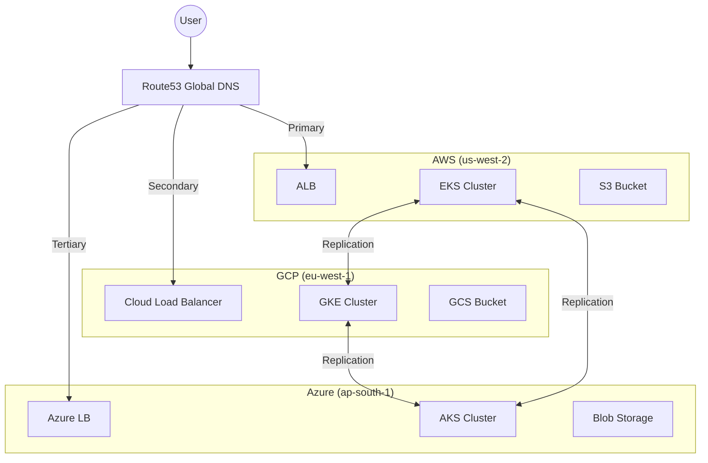

# Architecture: Multi-Region ML Platform

This document details the architectural design of the Multi-Region ML Platform, focusing on high availability, data consistency, and cost optimization across AWS, GCP, and Azure.

## 1. High-Level Design

The platform operates on a **hub-and-spoke** model (logically), though physically distributed across three primary regions:

*   **Primary Region (Active-Active)**: AWS `us-west-2` (e.g., handles write operations or primary traffic)
*   **Secondary Regions (Active-Passive/Active)**: GCP `eu-west-1` and Azure `ap-south-1`

### Global Connectivity
*   **Traffic Routing**: AWS Route53 Geolocation and Latency-based routing directs users to the nearest healthy region.
*   **Failover**: Route53 Health Checks monitor regional endpoints. If a region fails, DNS automatically reroutes traffic.

## 2. Core Components

### 2.1 Compute Layer (Kubernetes)
Each region hosts a Kubernetes cluster (EKS, GKE, AKS) running identical serving workloads.
*   **Namespace**: `ml-serving`
*   **Workloads**: Python-based inference services (FastAPI/TorchServe)
*   **Autoscaling**: HPA (Horizontal Pod Autoscaler) based on CPU/Memory/Custom Metrics.

### 2.2 Storage Layer (Object Storage)
Models and datasets are stored in cloud-native object storage:
*   AWS S3
*   GCP GCS
*   Azure Blob Storage

**Replication Strategy**:
The `ModelReplicator` service runs as a sidecar or cronjob.
1.  **Event-Driven**: Listens for new model uploads.
2.  **Checksum**: Calculates MD5/SHA256 of artifacts.
3.  **Sync**: Copies missing/updated artifacts to peer regions.

### 2.3 Failover System
The `FailoverController` is the brain of high availability.
*   **Health Checks**:
    *   *Liveness*: TCP probe to Load Balancer.
    *   *Readiness*: Application-level `/health` endpoint ensuring model is loaded.
*   **Decision Logic**:
    *   If `Primary` fails 3 consecutive checks -> Update DNS weight to 0 for Primary, 100 for Secondary.
    *   Sends `Critical` alert via `AlertManager`.

### 2.4 Monitoring & Observability
*   **Local**: Prometheus instances in each cluster scrape local pod metrics.
*   **Global**: A centralized `MetricsAggregator` federates key metrics (Request Rate, Latency, Error Rate) from all regions.
*   **Visualization**: Grafana dashboards use the aggregated data source.

### 2.5 Cost Optimization
The `CostAnalyzer` enables multi-cloud visibility.
*   **Ingestion**: Pulls billing data from AWS Cost Explorer, GCP Billing API, and Azure Cost Management.
*   **Normalization**: Maps provider-specific terms (e.g., "EC2 RunInstances", "Compute Engine Core") to unified categories ("Compute", "Storage", "Network").
*   **Prediction**: Uses historical trends to forecast End-of-Month spend.

## 3. Data Flow

### 3.1 Inference Request
1.  client -> `ml.example.com`
2.  Route53 -> Resolves to IP of nearest healthy Load Balancer (e.g., AWS ALB).
3.  ALB -> K8s Service -> Inference Pod.
4.  Pod -> Loads Model from Local Volume (synced from S3) -> Returns Prediction.

### 3.2 Model Deployment
1.  Data Scientist -> Uploads `model.tar.gz` to Primary Region Bucket (AWS S3).
2.  `ModelReplicator` (AWS) -> Detects new file.
3.  `ModelReplicator` -> Pushes to GCP GCS and Azure Blob.
4.  Serving Pods (All Regions) -> Detect new model version -> Hot reload.

## 4. Security

*   **Identity**: Workload Identity (GCP), IRSA (AWS), Managed Identity (Azure) for pod-level permissions. No long-lived keys.
*   **Network**: mTLS mesh (Linkerd/Istio) for inter-service communication (optional/roadmap).
*   **Encryption**:
    *   Rest: Server-Side Encryption (SSE-S3, Google-Managed Keys).
    *   Transit: TLS 1.2+ for all ingress and egress.

## 5. Technology Stack

| Component | Technology |
|-----------|------------|
| Infrastructure | Terraform |
| Container Orchestration | Kubernetes (EKS, GKE, AKS) |
| Language | Python 3.9+ |
| Web Framework | FastAPI / Aiohttp |
| Monitoring | Prometheus, Grafana, Alertmanager |
| DNS | AWS Route53 |
| CI/CD | GitHub Actions / ArgoCD (Recommended) |
